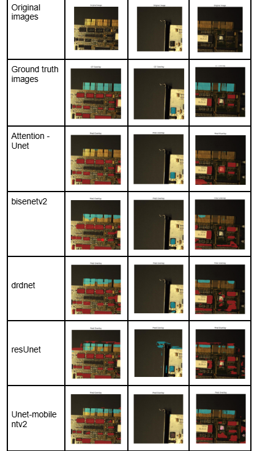
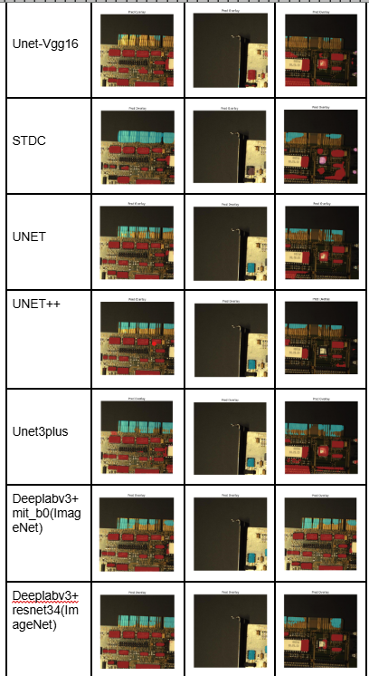
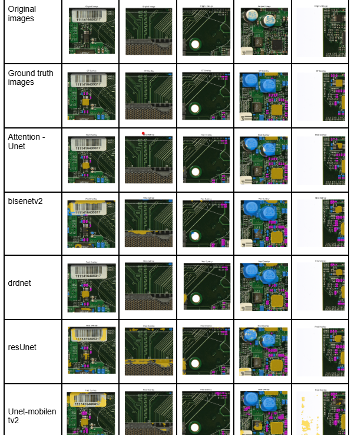
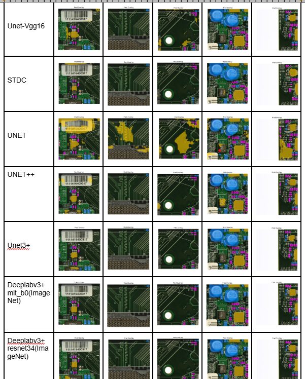

# PCB-Component-Segmentation-Networks-PyTorch

## Sample Outputs

### 1️⃣ Sample Segmentation results(PCBVision)
 |

### 2️⃣ Sample Segmentation results (FICS-PCB-Dataset)
 |

# PCB-Component-Classification-Networks-PyTorch

## Sample Outputs

| Model Name        | Sample Output                                                         |
| ----------------- | ----------------------------------------------------------------------|
| **DlnpNet**       |              |
| **PCBClassNet**   |      |
| **ConvNeXt Tiny** |  |
| **MobileNetV3**   |      |
| **EfficientNetV2**  |    |

